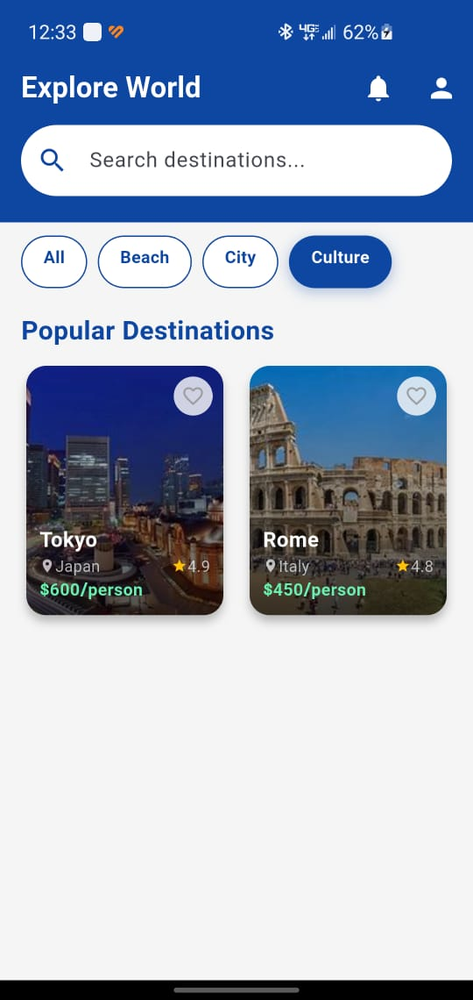
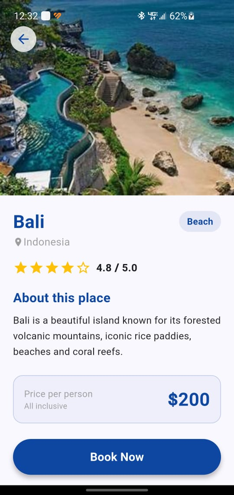

# ✈️ Travel App — Flutter Lab 3B

A Flutter travel application that lets users explore destinations, filter by category, view details, and make bookings.

## Features

- Browse travel destinations (Bali, Paris, Dubai, Tokyo, Rome)
- Filter by category: All, Beach, City, Culture
- View destination details with ratings and pricing
- Booking screen with trip confirmation

## Screens

### Home Screen


### Filter by Category


### Destination Detail — Paris


### Destination Detail — Rome


### Destination Detail — Bali


### Booking Screen


## Project Structure

```
lib/
├── data/
│   └── travel_data.dart       # Destination model & data
├── screens/
│   ├── home_screen.dart       # Main listing screen
│   ├── detail_screen.dart     # Destination detail
│   └── booking_screen.dart    # Booking form
├── widgets/
│   ├── destination_card.dart  # Card widget
│   └── category_chip.dart     # Filter chip widget
└── main.dart
```

## Getting Started

```bash
flutter pub get
flutter run
```

## Requirements

- Flutter SDK ≥ 3.0
- Dart ≥ 3.0
